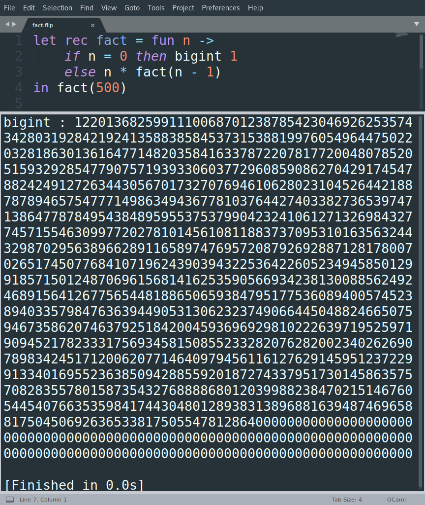

# Flip

Flip is a functional interpreted programming language, natively and efficiently supporting arbitrary-precision arithmetic.

## Main Features
Flip is a statically-typed language with a Caml-like syntax.

### Bigint type
The ```bigint``` type represents an arbitrary-precision integer.

A ```bigint``` can be declared by preceding an integer literal with the ```bigint``` keyword.

### Lists
Flip natively supports List literals. For instance, the following code:

```ocaml
[1; 2; 3]
```
is evaluated as a list of integers:
```ocaml
int list : [1; 2; 3]
```

The constructor of a list is the ```::``` operator.
As an example, the evaluation of the code
```ocaml
let a = [1; 2; 3]
in 0 :: a
```
yields the following result
```ocaml
int list : [0; 1; 2; 3]
```

Flip also defines some basic operations on lists.
You can extract the first element of a list as shown below:
```ocaml
[0; 1; 2].head
```
that is evaluated by the interpreter as:
```ocaml
int : 0
```
On the other hand, the code
```ocaml
[0; 1; 2].tail
```
returns
```ocaml
int list : [1; 2]
```

## Tuples
Flip also supports tuples. As an example, the code
```ocaml
(0, bigint 0)
```
is evaluated by the Flip interpreter as
```ocaml
(int * bigint) : (0, 0)
```

Flip also defines some built-in operations for tuples. For instance, you can get the first element of a pair as follows:

```ocaml
(0, 1).fst
```
Similarly, ```snd``` returns the second element of the pair.

### Exceptions Handling
Flip also supports exceptions. You can use the ```raise``` keyword to throw an exception, which can then be catched with a ```catch``` clause, as shown below.

```ocaml
try (
	raise "ExampleException"
)
catch "ExampleException" -> bigint -1
```

## Examples

This section provides some examples, showing some simple functions implemented in Flip (we refer to the statically-scoped version).

### Factorial Example
The following code implements the factorial function and computes the factorial of 500.
```ocaml
let rec fact = fun n ->
	if n = 0 then bigint 1
	else n * fact(n - 1)
in fact(500)
```

### Pow Example
The following code implements a function that raises its first argument to the power of the second argument. The function is then applied to raise 2 to the power of 100.
```ocaml
let rec pow = fun a -> fun b ->
  if b = 0 then bigint 1
  else if (b mod 2) = 0 then
    let p = pow(a)(b / 2) in p * p
  else
    a * pow(a)(b - 1)
in pow(2)(100)
```

### Insertion-Sort Example
The following code implements the insertion sort in Flip.
```ocaml
let rec insert = fun i l ->
	if l = [] then [i]
	else if i < l.head then i :: l
	else l.head :: insert (i l.tail)
in let rec sort = fun l ->
	if l = [] then []
	else insert (l.head sort (l.tail))
in sort ([51235; 445; 8; 68798; -25; -45])
```

### Fold-Right Example
The following code implements the ```fold_right``` function, which is then applied to compute the sum of the integers between 1 and 100.
```ocaml
let rec range = fun a b ->
	if b < a then []
	else a :: range ((a + 1) b)
in let rec fold_right = fun f l z ->
	if l = [] then z
	else f (l.head fold_right(f l.tail z))
in fold_right ((fun a b -> a + b) range(1 100) 0)
```


## Get started
First, you need to install OCaml and Camlp4.
On Ubuntu, you can run the following command:
```console
$ sudo apt-get install ocaml camlp4
```

The repository provides two interpreters, corresponding to a statically-scoped and a dynamically-scoped language.
In the following, we refer to the statically-scoped language and to a Unix environment.

Clone the repository and ```cd``` to the static ```static``` directory.
```console
$ git clone https://github.com/mattia-atzeni/flip
$ cd flip/static
```

In order to be able to use Flip within graphical applications such as text editors, we add some lines to the ```~/.profile``` file.

```console
$ echo export FLIP_HOME=`pwd` >> ~/.profile
$ echo "export PATH=\$PATH:\$FLIP_HOME/bin" >> ~/.profile
$ source ~/.profile
```

Now you can interpret any Flip program. As an example, form the ```static``` directory, you can run:

```console
$ flip test/fact.flip
```
to execute a program implementing the factorial function.

You can also integrate Flip in text editors such as [Sublime Text](https://www.sublimetext.com/).
For instance, in Sublime Text go to ```Tools -> Build System -> New Build System...```

Overwrite the content of the newly created file:
```javascript
{
	"shell_cmd": "flip $file"
}
```
Save the file as ```Flip.sublime-build```.

Now, open the ```static/test/fact.flip``` file in Sublime Text. From ```Tools -> Build System``` select ```Flip```.

Press ```Ctrl + B``` to run the Flip interpreter.

This will run the program ```fact.flip``` and compute the factorial of 500, as shown in the figure below. As you can see, Flip takes advantage of the ```bigint``` type to natively support arbitrary-precision arithmetic.

<p align="center">

</p>
